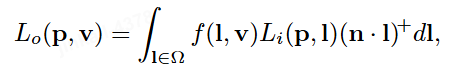
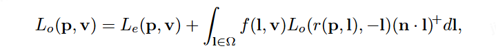
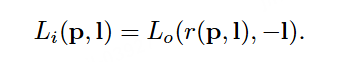
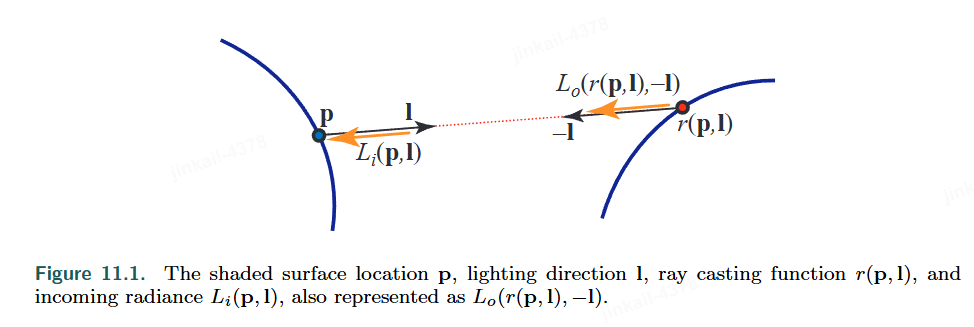

The common reflectance equation：

We will use the new version:

$$L_e(p,v)$$ is the emitted radiance from the surface location $p$ in direction $v$

This term means that the incoming radiance into location $p$ from direction $l$ is equal to the outgoing radiance from some other point in the opposite direction $−l$.

