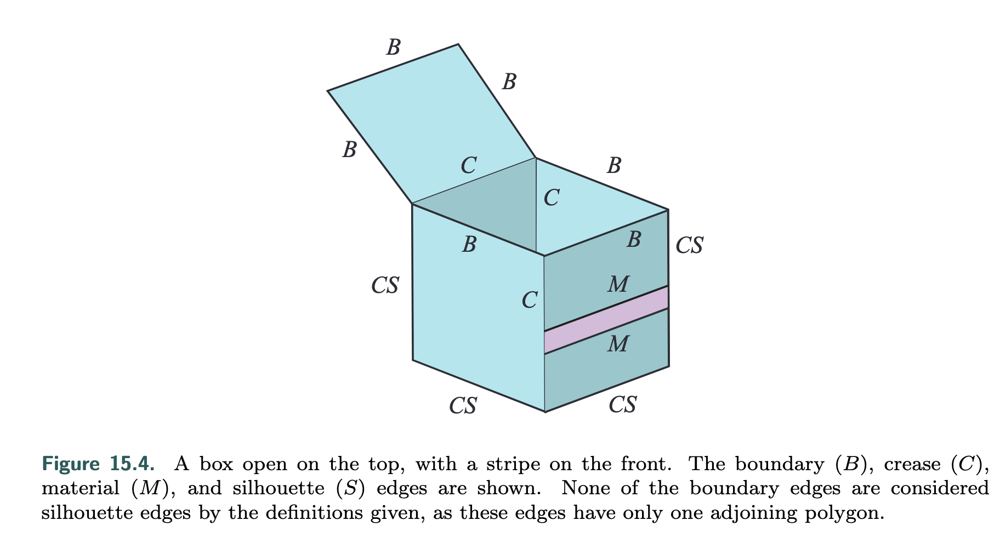
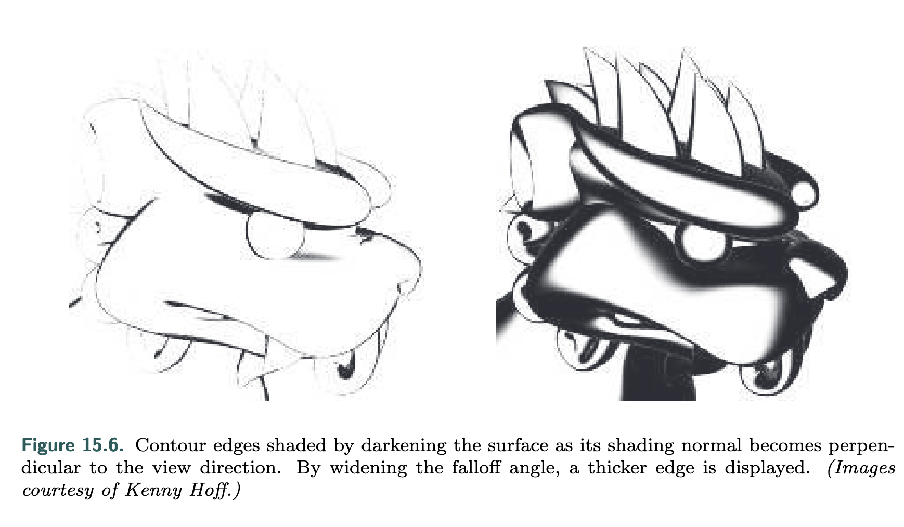

Methods used can be roughly categorized as based on surface shading, procedural geometry, image processing, geometric edge detection, or a hybrid of these.

## Edge Categorization

* A **boundary** or **border edge** is one not shared by two triangles, e.g., the edge of a sheet of paper. A solid object typically has no boundary edges.
* A **crease**, **hard**, or **feature edge** is one that is shared by two triangles, and the angle between the two triangles (called the dihedral angle) is greater than some predefined value. A good default crease angle is 60 degrees. As an example, a cube has crease edges. Crease edges can be further subcategorized into ridge and valley edges.
* A **material edge** appears when the two triangles sharing it differ in material or otherwise cause a change in shading. It also can be an edge that the artist wishes to always have displayed, e.g., forehead lines or a line to separate the same colored pants and shirt.
* A **contour edge** is one in which the two neighboring triangles face in different directions compared to some direction vector, typically one from the eye.
* A **silhouette edge** is a contour edge along the outline of the object, i.e., it separates the object from the background in the image plane.

Contour edges should not be confused with contour lines used on topographical maps.

## Shading Normal Contour Edges

The dot product between the **shading normal** and the **direction to the eye** can be used to give a contour edge. If this value is near zero, then the surface is nearly edge-on to the eye and so is likely to be near a contour edge. Color such areas black, falling off to white as the dot product increases.

**Drawbacks**

* Contour lines are drawn with variable width, depending on the curvature of the surface.
* Only work for curved surfaces without crease edges.
* ...

