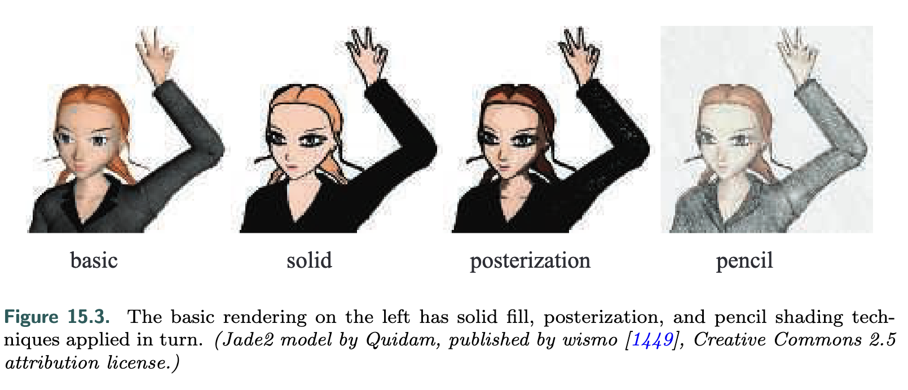

There has been a large amount of attention given to one particular form of **NPR**, cel or toon rendering.

The core is "**amplification through simplification**". By simplifying and stripping out clutter, one can amplify the effect of information relevant to the presentation.

### Two-tone shading

Sometimes called *hard shading*, is simple to perform in a pixel shader by using a lighter color when the dot product of the shading normal and light source direction are above some value, and a darker tone if not.

### Posterization

When the illumination is more complex, posterization is used, using a continuous range of values and converting to a few tones, with a sharp change between each.

Quantizing RGB values can cause unpleasant hue shifts, as each separate channel changes in a way not closely related to the others. So working a **hue-preserving color space** such as HSV, HSL, or Y’CbCr is a better choice.

To add view-dependent effects by using two-dimensional maps in place of one-dimensional shade textures. The second dimension is accessed by the depth or orientation of the surface, combined with a variety of other shading equations and painted textures gives a blend of cartoon and realistic styles.

