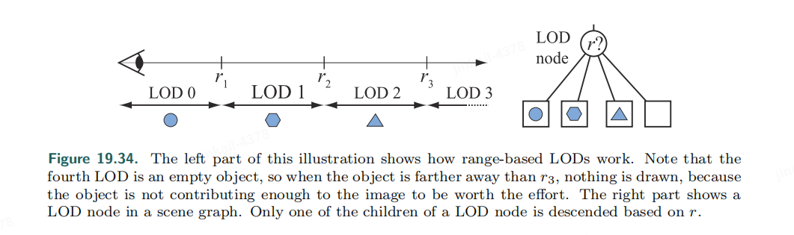
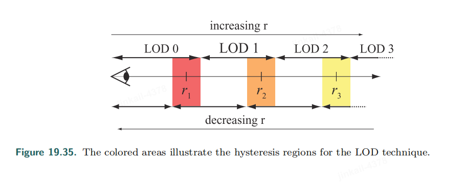
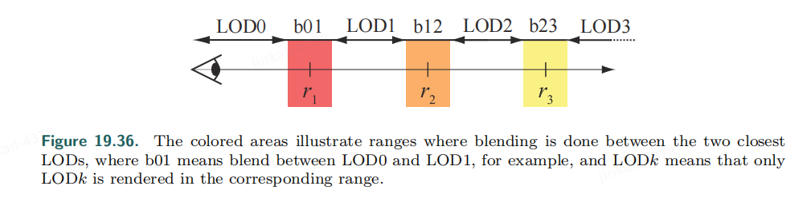

## LOD Switching

When switching from one LOD to another, an abrupt model substitution is often noticeable and distracting. This difference is called *popping*. We have several ways to perform switching.

### Discrete Geometry LODs

The switching from one LOD to another is sudden. That is, on the current frame a certain LOD is used, then on the next frame, another LOD is used immediately for rendering.

* This algorithm is well suited for modern graphics hardware, as these static meshes can be stored in GPU memory and reused.
* Work well if switching occurs at distances where difference is barely visible.

Popping is typically the **worst** for this method.

### Blend LODs

To do a linear blend between the two LODs over a short period of time is ideal. 

However, rendering two LODs is more expensive than just rendering one LOD. But the quality improvement may well be worth the cost as switching doesn't take place in each frame, for each object, at each distance.

Blend operaton "over" is used to render the semitransparent object. Assume a transition between two LODs—say LOD1 and LOD2—is desired, and that LOD1 is the current LOD being rendered.

$$C_{out} = C_{LOD1} \cdot (1 - \alpha_{LOD2}) + C_{LOD2} \cdot \alpha_{LOD2} $$

1. First draw LOD1 opaquely to the framebuffer (both color and z).
2. LOD2 should be rendered with the **z-test enabled** and **z-writes disabled**.

* Using **back-projection** and  **visibility textures**, we can only update one of the LODs on each frame and reuse the other LOD from the previous frame. https://onlinelibrary.wiley.com/doi/abs/10.1111/j.1467-8659.2008.01255.x

### Alpha LODs

 Used if only one LOD mesh is available.

As the metric used for LOD selection (e.g., distance to this object) increases, the overall transparency of the object is increased (α is decreased), and the

object finally disappears when it reaches full transparency (α = 0.0).

### CLODs and Geomorph LODs

TODO..

## LOD Selection

These techniques can also be used to select good occluders for occlusion culling algorithms.

### Range-Based

A rapid cycling back and forth around the $r_i$​ occurs rapid popping. This can be solved by introducing some *hysteresis* around the $r_i$ value

Specifically for blending two LODs in the transition range, this is not ideal, since the distance to an object may reside in the transition range for a

long time, which increases the rendering burden due to blending two LODs.

Switching during a finite amount of time is a good idea.

