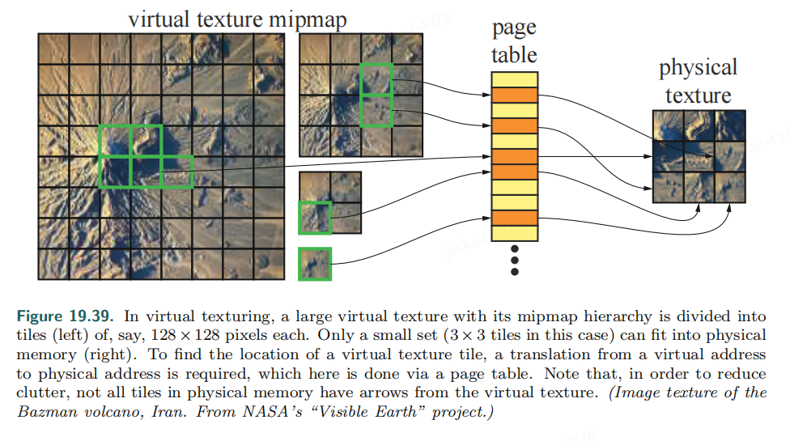
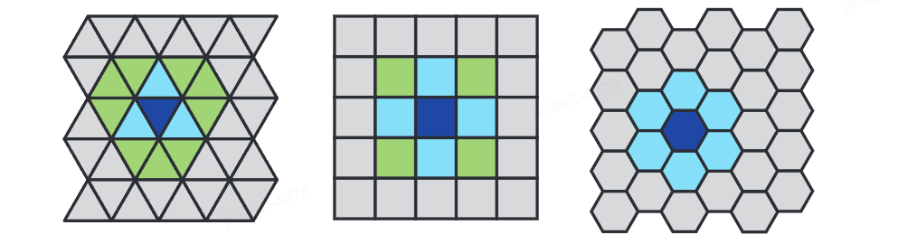
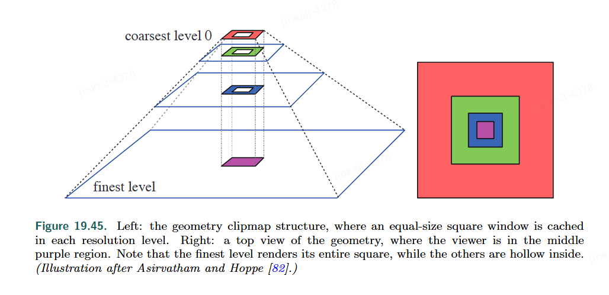

## Virtual Texturing

When memory is limited on the CPU, operating systems use virtual memory for memory management, swapping in data from the drive to CPU memory as needed.

This functionality is what *sparse textures*, *virtual texturing* or *partiallly resident texturing*

The entire mipmap chain is **divided into tiles** in both virtual and physical memory.

Before the global uv-parameterization is used in a pixel shader, they need to be translated into texture coordinates that point into physical texture memory.

## Texture Transcoding

1. Read an image compressed with a typically variable-rate compression scheme from disk.
2. Decode it.
3. Encode it using GPU-supported texture compression scheme.

## General Streaming

In large scenes, a streaming system is needed.

A plane can be tiled by regular convex polygons using either **triangles**, **squares**, or **hexagons**. 

Assume that the viewer is located in the dark blue polygons and the streaming system ensures that the surrounding geometry(green and light blue) is available for rendering when the viewer moves into a neighbouring polygon. 

Squares and hexagons are most commonly used as these have fewer immediate neighbors than triangles.

## Terrain Rendering

Several popular methods that perform well on current GPUs are described followed.

### geometry clipmap

