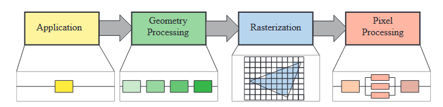
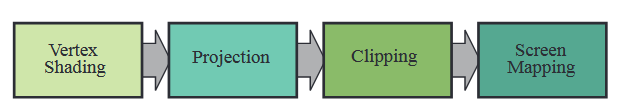

*"A chain is no stronger than its weakest link."*

------

# Application Stage

The developer has full control over what happens in the **application stage** since it executes on the CPU

Some of the tasks **traditionally** performed on the CPU include *collision detection, global acceleration algorithms, animation, physics simulation,* and many others, depending on the type of application.

At the end of the application stage, rendering primitives to be rendered are fed to geometry stage.

# Geometry Processing

This stage is further divided into the following stages:

## Vertex Shading

* Traditionally, much of the shade was computed in the vertex shader.

* The vertex shader is now a more general unit dedicated to setting up the data associated with each vertex. 

  From **model space -> world space -> view space**, and after projection, the models are said to be in the **clip space**.

After display, the z-coordinate is not stored in the image but is stored in a z-buffer.

## Optional  Vertex Processing

After vertex processing, optional stages can take place in this order: **tessellation**, **geometry shading**, and **stream output**, and each is optional.

**Tessellation**: Vertices can be used to describe a curved surface, surfaces can be specified by a set of patches, and each patch is made of a set of vertices. The camera for the scene can be used to determine how many triangles are generated: many when the patch is close, few when it is far away.

**Geometry Shading**: This stage produces new vertices. It is a much simpler stage as the creation is limited in scope and the types of output primitives are much more limited. One of the most popular is **particle generation**.

**Stream Output**: Instead of sending our processed vertices down the rest of the pipeline to be rendered to the screen, at this point we can optionally output these to an array for further processing. This stage is typically used for **particle simulations**.

Regardless of which (if any) options are used, if we continue down the pipeline we have **a set of vertices with homogeneous coordinates** that will be checked for whether the camera views them.

## Clipping

A primitive that lies fully inside the view volume will be passed on to the next stage as is. Primitives entirely outside the view volume are not passed on further, since they are not rendered. It is the primitives that are **partially inside** the view volume that require clipping.

After clipping, **perspective division** is performed to place positions into three-dimensional **normalized device space**.

## Screen Mapping

# Rasterization

# Pixel Processing

