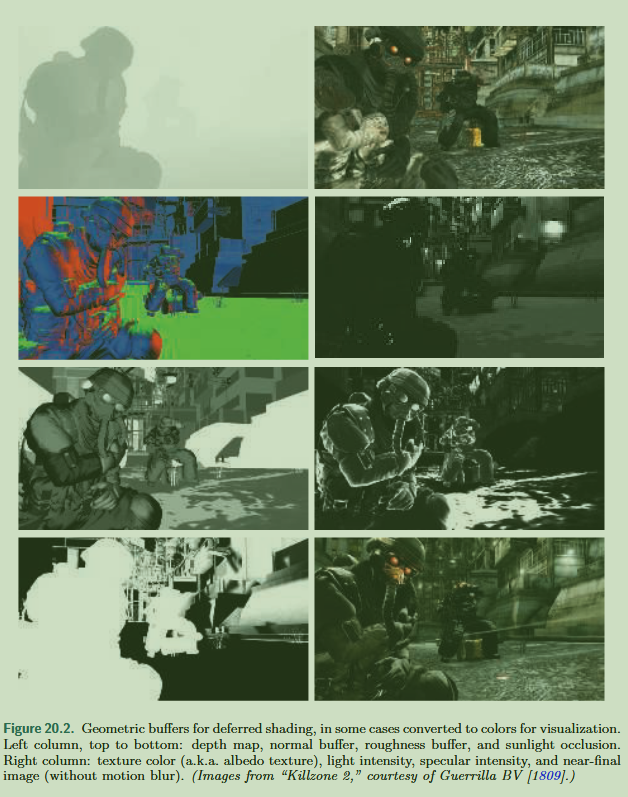
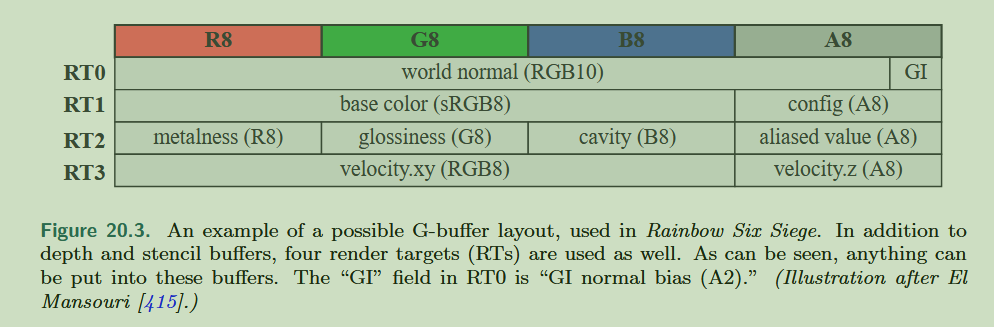

The idea behind deferred shading is to perform all visibility testing and surface property evaluations **before** performing any material lighting computations.

## Drawbacks

**Basic** deferred shading has some drawbacks

* G-buffer video memory requirements and bandwidth costs can be significant.
* **Transparency** is not supported in a basic deferred shading system, since we can store only one surface per pixel.
* Using MSAA increases memory costs and fill rate.

