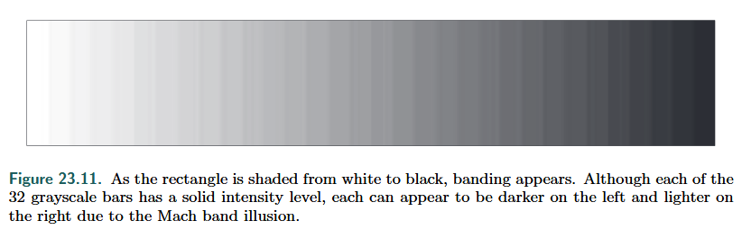
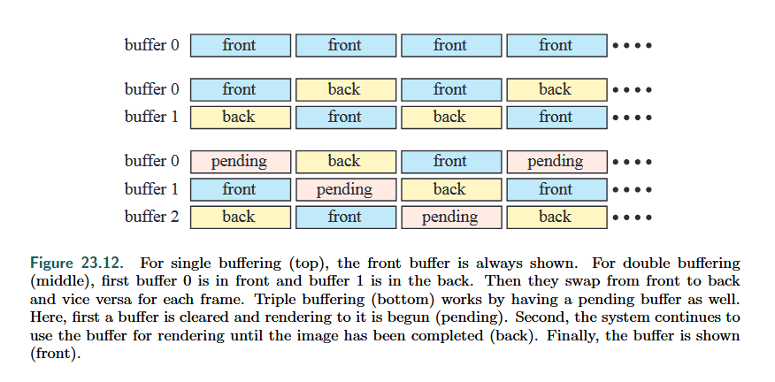

## Color Mode

Color buffering has a few color modes： High color, True color and Deep color

* **High color**: 2 bytes per pixel. 

  * accessed more quickly

  * rarely used. is easily discernible for limited precision. cause *banding* or *posterization*

    

    *Mach banding*

  * **Dithering** or **Adding noise** can solve the problem

* **True color**( RGB ): 3 or 4 bytes per pixel

  * 1 byte for each color channel, 1 byte for alpha, 24-bit can be considered as the packed format of the 32-bit format
  * acceptable  for real-time rendering, though it is also possible to see bandings of colors

* **Deep color**: more

## Buffering

**Double buffering**: one front buffer and one back buffer

**Tripple buffering**: one more back buffer called *pending buffer*, augmented from double buffering.

* when the front buffer and back buffer are swapped, pending buffer can be rendered.
* the drawback is that the **latency** of user inputs **increases** up to one entire frame. User events are defered after the pending buffer begins to render

