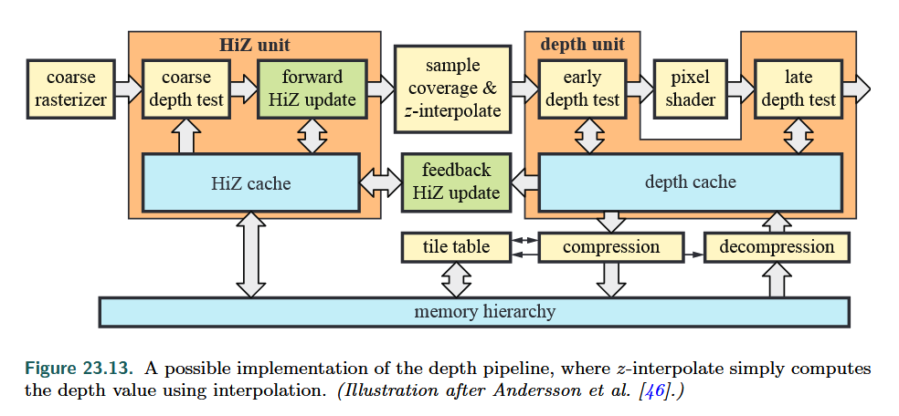

z-buffer( depth buffer )

* have 24 bits or 32 bits per pixel
* use **floating point** or **fixed-point** representation

 

### HiZ Unit

HiZ unit is where **z-culling** executes.

In the **coarse depth test**,  $z_{\max}$-culling and $z_{\min}$-culling are performed. z-culling only boosts depth test afterwards

 $z_{\max}$-culling

* store the maximum ($z_{\max}$)  of all the depths within each tile
* these maximums are stored in on-chip memory( i.e. HiZ ache)
* we test if a triangle is occluded in a tile: 
  * find the minimum z-value on the triangle inside the tile($z_{\min}^{\text{tri}}$)
  * if $z_{\min}^{\text{tri}}$ > $z_{\max}$, we comfirm that the triangle is occluded in this tile, thus following per-pixel depth test can be jumped
* **howerver**, we have to estimate $z_{\min}^{\text{tri}}$ 

 $z_{\min}$-culling is quite the same, stori the minimum($z_{\min}$)  of all the depths within each tile

### Early-z

per-sample depth test performed before the fragment shader, and occluded fragments are discarded

**z-prepass**

* renders the scene while writing only depth, disabling pixel shading, and writing to the color buffer.
* then an “equal” test is used, meaning that only the frontmost surfaces will be shaded since the z-buffer already has been initialized

------

z-culling and early-z are automatically used by GPU under many circumstancs.

However, these have to be disabled if, for example, the pixel shader writes a custom depth, uses a discard operation, or writes a value to an unordered access view

## TODO

**floating point** or **fixed-point**?