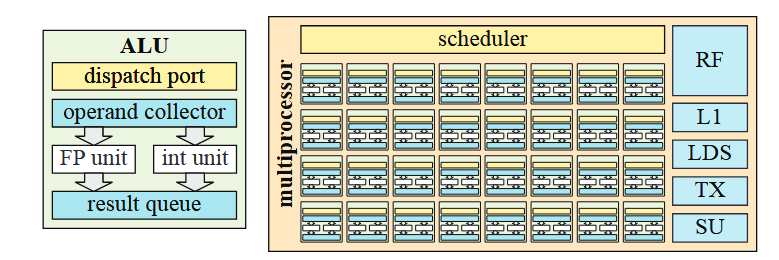
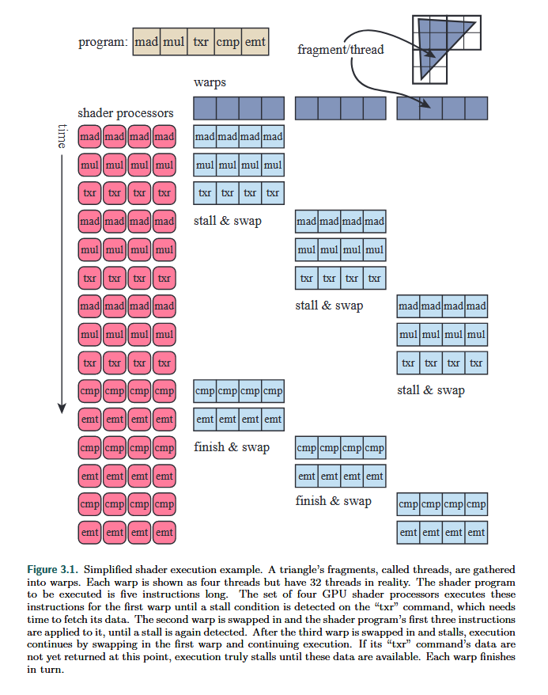

## ALU and Multiprocessor

### ALU

 left, arithmetic logic unit

* ALU also called *SIMD lane*
* dispatch port ==receives instructions==
* operand collector ==reads the registers== needed by instructions
* main compute units are ==floating point unit(FP unit)== and ==int unit==
* ==move/compare== and ==load/store==

### Multiprocessor

right, MP

* 8 * 4 ALUs have assembled together with several other hardware units
* execute the same programme in ==lock-step==
* scheduler dispatches instructions onto ALUs
* register file, L1 cache, local data storage, texture units and special units
* the exact contents of an MP varies from vendor to vendor

### Latency and Occupancy

**Occupancy**: 
$$
o = \frac{w_{\text{active}}}{w_{\text{max}}}
$$
where $w_{\text{max}}$ is the maximum number of warps allowed on an MP, and $w_{\text{active}}$ is the number of currenctly active warps.

*it is important to design an architecture with a well-balanced number of maximum warps, maximum registers, and other shared resources.*

## Data-Parallel Architectures

### 基础架构

* fragment shader每一次调用称为一个**thread**（不同于CPU中的thread），每一个thread都会被映射到一个**SIMD lane**；使用同一个fragment shader的若干thread打包成组，称为**warps(或者wavefronts)**。一个warp会被分配给一些GPU shader cores，利用SIMD进行执行；
* lockstep(步调一致)：一个warp中所有thread在执行时保持**lockstep**。例如，如果在执行时某个thread需要访问内存中的数据，那么warp中其他的thread此时也一定是需要访问内存中的数据。
* warp-swapping(线程束切换)：如果warp需要访问内存，此时，warp会被换出，让出shader cores，一个新的warp换入，获得GPU资源并执行；warp换入换出的过程很快，因为warp会保存正在执行的指令，warp中的thread所占用的寄存器也不受影响，GPU只需要改变“指针”即可访问另一个warp中的寄存器，因此warp的切换成本很低。==warp-swapping技术是GPU中隐藏延迟，提高占用率的主要机制==
* 如果只有少量的warp，那么当一个warp堵塞时候，只有少量的warp供GPU调度执行，此时访存这种费时的操作难以被掩盖，GPU的使用率很低。所以可以用更多的warp通过交换来掩盖延迟。

### 主要影响因素

1. 每个thread所使用的寄存器数量：如果所有的寄存器都驻留在GPU中，那么在GPU中驻留的thread和warp数量就会受到限制，warp数量受限就会导致低使用率；
2. 访问内存的频率
3. thread divergence：着色器代码中的**条件判断语句**和**循环**会影响效率。在一个warp中，一些thread执行if中的内容，另一些执行else内容，那么warp就会把两个分支的路径都执行一遍，然后丢弃特定线程不需要的结果，造成极大的性能浪费

## Buses & Video memories

* Access to video memory is usually much faster than to system memory over a bus
* Traditionally, textures and render targets are stored in video memory; *Static* vertex and index buffers which remain unchanged can also be placed in video memory
* Some devices use unified memory architecture( UMA ), which means that both the CPU and the graphics accelerator use the same memory
* Using a **cache hierarchy** is necessary if there is some kind of ==locality== in the accesses. 

## Caching & Compression

* Most buffers and texture formats are stored in tiled formats
* compressor and decompressor are to be used losslessly
  * *tile table* is the core to handle that, which has additional information stored for each tile
  * the state( **compressed, uncompressed, or cleared** ) of each tile is stored in *tile table*
  * tiles flagged as cleared will not be decopressed and will be stored in cache directly!

