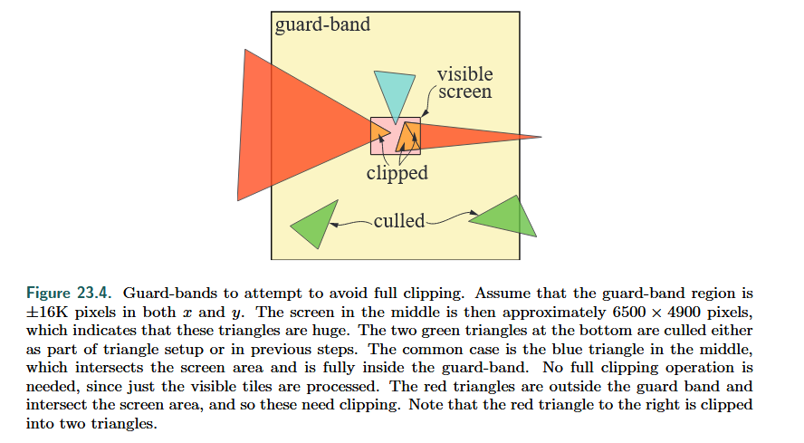
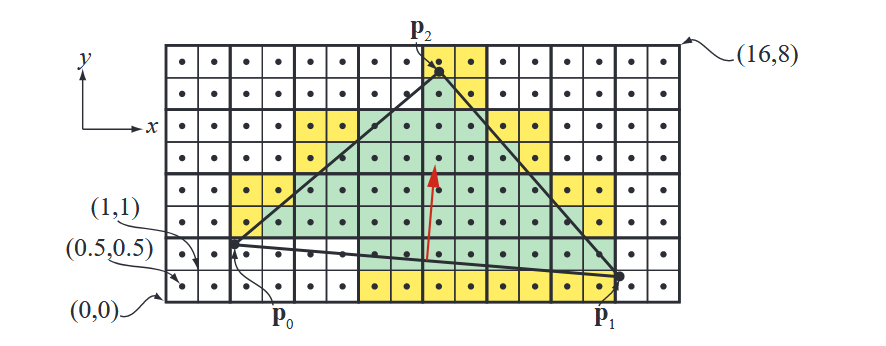
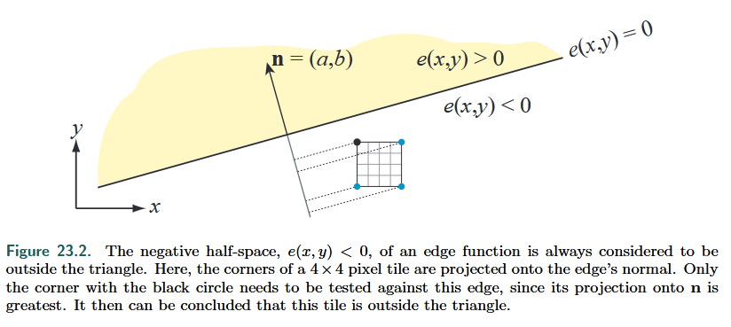
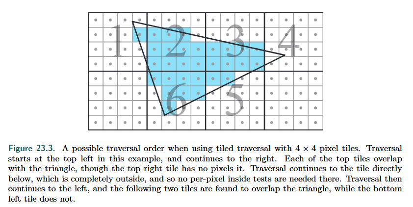

## Before rasterization

Clipping is done before triangle setup.

* Clipping against the **view volume** is expensive, but against the near plane is always needed.
* For simplicity, *guard-band clipping* is used in most GPUs to avoid more complex clip process.

## Rasterization

* Green pixels are inside the triangle
* **Helper pixels**, in yellow, belong to quads (2 × 2 pixels) where at least one pixel is considered inside, and where the helper pixel’s sample point (center) is outside the triangle.
* Helper pixels are needed to compute derivatives using **finite differences**.

To be able to compute derivatives, which are needed for **texture level of detail**, pixel shading is computed for all quads where at least one pixel is inside the triangle.

**Quad overshading** is such a scenario, where few pixels are covered by a triangle, but many helper pixels are needed.

### Edge Functions

The line equation, $\mathbf{n} \cdot ((x, y) - \mathbf{p}) = 0$, where $$\mathbf{n}$$ is the normal of the edge, and $$\mathbf{p}$$ is a point on the line, can be rewritten as $$e(x, y) = ax + by + c$$ in the screen-space coordinates.

For points $$(x,y)$$ exactly on an edge, we have $$e(x, y) = 0$$.

The edge divides the space into two parts and $$e(x, y) > 0$$ is sometimes called the **positive half-space** and $$e(x, y) < 0$$ is called the **negative half-space**.

If a sample point $$(x, y)$$ is inside the triangle or on the edges, then it must hold that $$e(x, y) >= 0$$ for all three edges.

### Tiled Traversal

We perform hierarchical traversal to improve efficiency.

* Select a closest tile corner to test. And if this selected corner is outside one edge, then the entire tile is outside.

  

* To move to a neighboring tile, the incremental property described above can be used per tile. For example, to move horizontally by 8 pixels to the right, one needs to add 8a.

* To increase coherency, the tiles need to be traversed in some order.

  

### Tie-breaker rule

If two triangles **share** an edge and this edge goes **exactly** through a pixel center. Which pixel does this pixel belong to?

Tie-breaker rule is commonly used to solve this problem.

In DirectX, *top-left rule* is used:

* The pixel is considered inside if its center lies on an edge that is either a **top edge** or a **left edge**.
* A triangle can have at most two left edges.
* We evaluate the normal vector $$(a, b)$$. A top edge has $$a=0$$ and $$b<0$$, while a left edge has $$a>0$$.

