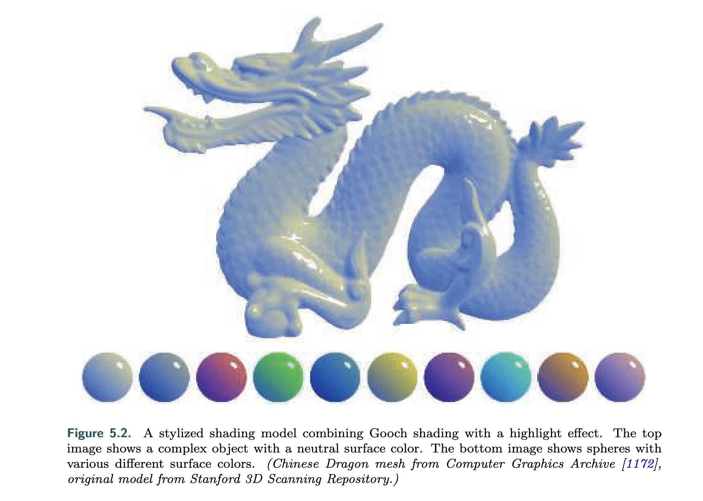

Introduce *Gooch shading model*, a non-photorealistic model to increase legibility of details in technical illustrations.

The result is affected by several factors:

* surface orientation **n**
* view directions **v**
* ligthting directions **l**

Check RTR 5.1 to get more details...

